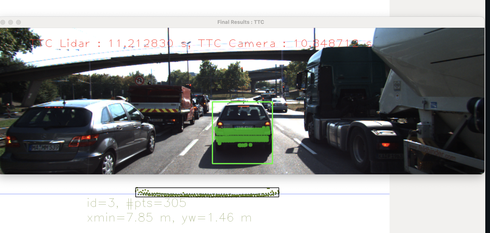
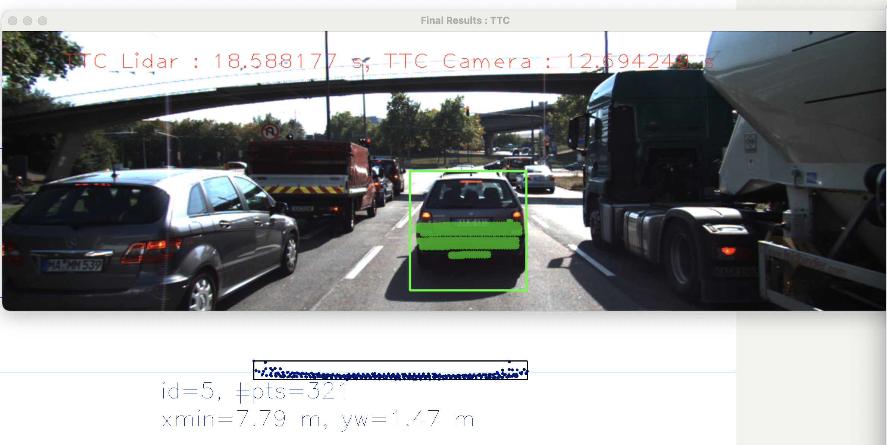
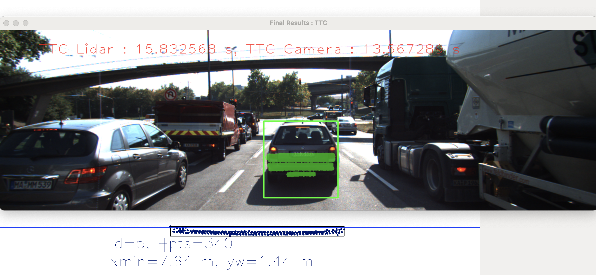

# SFND 3D Object Tracking

Welcome to the final project of the camera course. By completing all the lessons, you now have a solid understanding of keypoint detectors, descriptors, and methods to match them between successive images. Also, you know how to detect objects in an image using the YOLO deep-learning framework. And finally, you know how to associate regions in a camera image with Lidar points in 3D space. Let's take a look at our program schematic to see what we already have accomplished and what's still missing.

In this final project, you will implement the missing parts in the schematic. To do this, you will complete four major tasks: 
1. First, you will develop a way to match 3D objects over time by using keypoint correspondences. 
2. Second, you will compute the TTC based on Lidar measurements. 
3. You will then proceed to do the same using the camera, which requires to first associate keypoint matches to regions of interest and then to compute the TTC based on those matches. 
4. And lastly, you will conduct various tests with the framework. Your goal is to identify the most suitable detector/descriptor combination for TTC estimation and also to search for problems that can lead to faulty measurements by the camera or Lidar sensor. In the last course of this Nanodegree, you will learn about the Kalman filter, which is a great way to combine the two independent TTC measurements into an improved version which is much more reliable than a single sensor alone can be. But before we think about such things, let us focus on your final project in the camera course. 

## Dependencies for Running Locally
* cmake >= 2.8
  * All OSes: [click here for installation instructions](https://cmake.org/install/)
* make >= 4.1 (Linux, Mac), 3.81 (Windows)
  * Linux: make is installed by default on most Linux distros
  * Mac: [install Xcode command line tools to get make](https://developer.apple.com/xcode/features/)
  * Windows: [Click here for installation instructions](http://gnuwin32.sourceforge.net/packages/make.htm)
* Git LFS
  * Weight files are handled using [LFS](https://git-lfs.github.com/)
* OpenCV >= 4.1
  * This must be compiled from source using the `-D OPENCV_ENABLE_NONFREE=ON` cmake flag for testing the SIFT and SURF detectors.
  * The OpenCV 4.1.0 source code can be found [here](https://github.com/opencv/opencv/tree/4.1.0)
* gcc/g++ >= 5.4
  * Linux: gcc / g++ is installed by default on most Linux distros
  * Mac: same deal as make - [install Xcode command line tools](https://developer.apple.com/xcode/features/)
  * Windows: recommend using [MinGW](http://www.mingw.org/)

## Basic Build Instructions

1. Clone this repo.
2. Make a build directory in the top level project directory: `mkdir build && cd build`
3. Compile: `cmake .. && make`
4. Run it: `./3D_object_tracking`.

### FP.1 Match 3D Objects
To calculate matches which are the ones with the highest number of keypoint correspondences, one 2D matching_scores matrix is created, bounding boxes in previous frame (rows) x bounding boxing in current frame(column).
Traversing matches, locating matched keypoints in previous and current frames. checking those keypointes if they belong to one of the bounding boxes of their frame. if they both can be found inside a bounding box accordingly, write down the index nummber of bounding boxes respectively and score one point in matching_scores matrix.
for each column of scores matrix, search for the row with highest scores. this bounding box combination is the best matches with the highest number of keypoint correspondences.

### FP.2 Compute Lidar-based TTC
To calculate ttc based on lidar measurements we need to get time difference between two frames and the min. distance of each frame.
Because of the noisy distance measurement, outlier Lidar points should be filtered out. we assume that the noisy distance measurement is gaussian distrubition so the lidar point who is out of the range [mean-1.5 x Standard deviation, mean+1.5 x Standard deviation] will be considered as outlier.

### FP.3 Associate Keypoint Correspondences with Bounding Boxes
TO associate keypoints correspondences with bounding boxes, it is needed to iterate over the keypoint matchers vector, find out the corresponding keypoint for current frame who is inside ROI and then calculate euclidean distance between 
matched keypoints. To filter outlier, it is necessary to compute the mean euclidean distance of all matched keypoints.
any keypoint which has a displacement between two successive frames beyond a threshold (mean x factor) will be ignored.
finally, qualified keypoint matchers would be add to bounding boxes property.

### FP.4 Compute Camera-based TTC
To compute TTC, it is needed to create a vector to storage euclidean distance ratio between two keypoints in successive frames. that distance needs to satisfy the minimum distance, only far seperated keypoints are meaningful. To overcome  the interference of outlier it is more robust to use median value instead of mean value. finally, compute the TTC using that formula from lesson.

### FP.5 Performance Evaluation 1

As showed below, TTC increases 7s suddenly from 11s and then back to 15s. because I can't find any interference of outlier so I assume that it is because of the small min. distance difference between two frames.

 
 
 

 ### FP.6 Performance Evaluation 2
 As an example showed below, based on the comparison of mid-term project, these top 3 combinations out performance the others on speed and accuracy. As a bad example, Harris give us a bad performance becouse of small amount of detected keypoints.

 |Sr. No. | lidar | FAST + ORB | FAST + BRIEF |SHITOMASI + BRIEF |
|:---:|:---:|:---:|:---:|:---:|
|1 |14.3|11.4 |11.7| 14.6|
|2 | 11.2|10.8 |11.7 | 13.9|
|3 | 18.5|12.6|13.7 | 9.7|
|4 |15.8 |13.5 |12.8 | 14.9|
|5 |13.2 | 14.3|13.4 | 12.7|
|6 |10.3 |12.5 |13.7 | 13.2|
|7 | 12.4|13 |13.2 | 15.2|
|8 |15.0 |11.9 |12.3 | 12|
|9 |15.8 |11.9|12.2| 11.8|
|10 |15.1 |11 |12.5 | 12.6|
|11 |9.7|9.9 |11.7 | 11.8|
|12 |12.3 |11.5 |11.3 | 11.7|
|13 |7.9 |10.4|12.3 | 11.7|
|14 |12.5 |10.9 |10 | 11.3|
|15 |7.9|10.9|11.5 | 12.1|
|16 |9.2 |9.4|10.5 | 8.2|
|17 |10.9 |9.1 |10.3| 11.1|
|18 |7.4 |11|11.0 | 8.4|